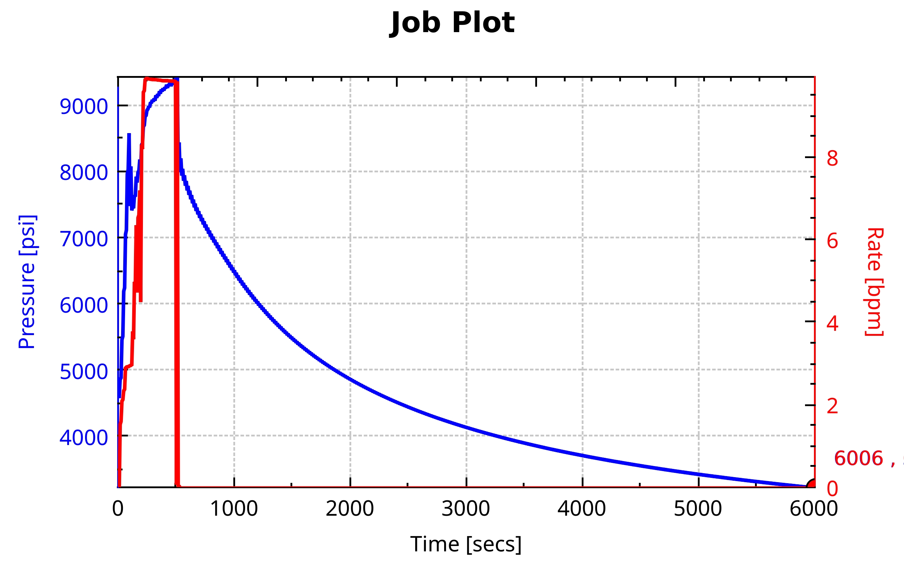
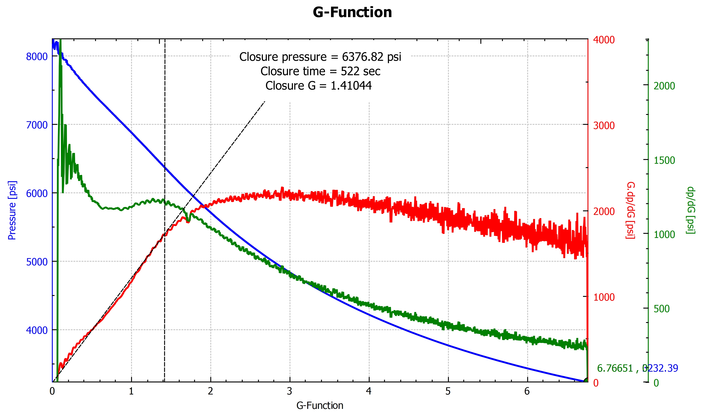
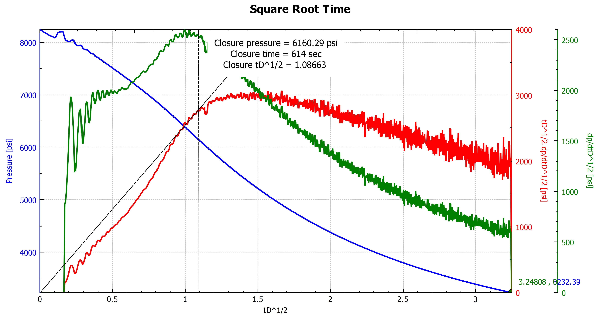

# DFIT Analysis Version 1
This program helps with the analysis of Diagnostic Fracture Injection Tests (DFIT). It employes the standard G-Function and Square root analysis techniques. It has been written in C++ to be fast and optimized. It has been tested with 1+ Million points. Loading large number of points is as fast as MS Excel, while plotting is and analyses are much faster.

## How to Use

### Download
For Windows 7 to 10, download all files located in release/win32. 
Run PSDFITAnlaysis.exe.

### Workflow
1. Load the data from csv file or open existing project. 
2. From the plot/table identify the time at which injection stops.
3. Input the injection time using the "Enter Injection Time" button.
4. Push "G-Function" and/or "Sqrt Time" buttons to open the plots. Multiple analyses may be performed. 
5. Figures may be rescaled by buttons at the bottom.
6. Derivatives smoothing may also be performed by selecting the number of points used for computing derivatives by hitting the button "Derivative Smoothing".
7. On the plots, use the buttons to draw a straing line through origin.
8. Based on the departure of data from the straight line, select the closure using the button.
9. Closure time and pressure will be displayed on the figure.
The figures are interactive and display the plot data cursor on mouse over. Figures may also be exported as csv or as jpg files. 

### Saving/Loading
The session is saved by saving all the open windows and data, including the closure analyses to .dft file. Session may be restored alongwith all open windows and analyses results upon loading from the .dft file.

### Example Well1
Example of Well1 is included. Either "open" the Well1.dft file, or "open csv" the Well1.csv file.

## Contributing
Git clone or download all files. Open the DFITAnalysis.pro file with Qt-Creator. Works and tested with 
1. Clang on Xubuntu (Qt-Creator)
2. G++ on Xubuntu (Qt-Creator)
3. MSVC on Windows 7 (Qt-Creator)

### Open Source
This program is released as open source under Mozilla Public License (MPL) v2. The complete source code may be obtained from

It uses following:
1. Qt 5.11 https://www.qt.io/ (GNU GPL v3)
2. qcustomplot library https://www.qcustomplot.com/ (GNU GPL v3)
3. Eigen library http://eigen.tuxfamily.org  (MPL v2)

## Contact
Please visit www.FahdSiddiqui.com.

